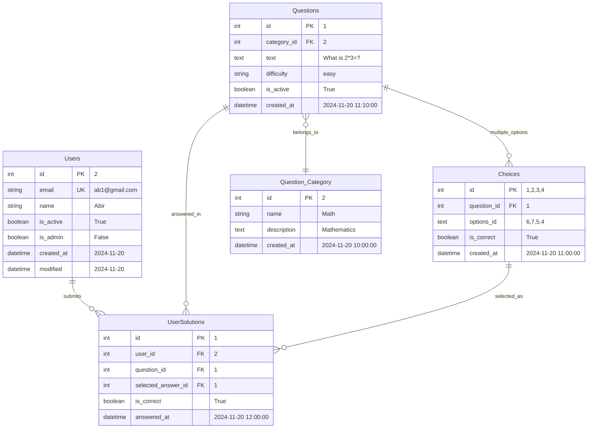
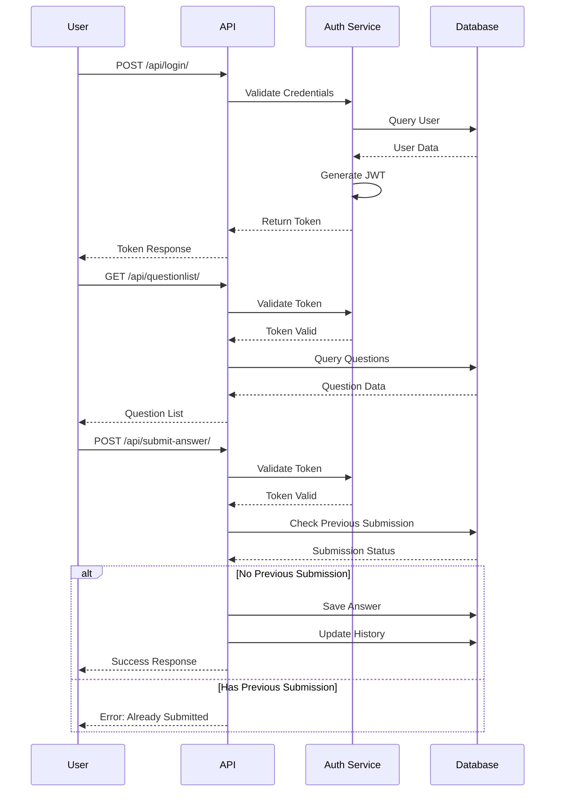

<h1 align="center">
📝Quizbit MCQ API
</h1>

<p align="center"> 
This is a MCQ Simulation API, a platform for practicing Multiple Choice Questions (MCQs).<br>
A web app that implemented Django Rest Framework and provided functionality for user registration, login, question retrieval, submit answer and view user submission history.<br>
The API used PostgreSQL as the database and Django Simple JWT for authentication.
</p>

## 📑 Table of Contents
- [⭐ Features](#features)
- [🛠️ Prerequisites](#prerequisites)
- [💻 Installation](#installation) 
- [📊 Database Models](#database-models)
- [🔄 Entity Relationship Diagram](#entity-relationship-diagram)
- [🌱 Populate Database](#populate-database)
- [➡️ Data Flow](#data-flow) 
- [🚀 API Endpoints](#api-endpoints)

## ⚠️ NB:  
- 🚧 **The main branch is in initial stage. More advanced features are being added in branch** [version_2](https://github.com/YeakubSadlil/quizbit/tree/version_2)
- 🗂️ **All project tracking and plans are in the** [Project Tab](https://github.com/users/YeakubSadlil/projects/3)
  
## Features

1. User Authentication
- User Registration with password confirmation
- User Login with email and password
2. Question Retrieval
- Retrieve a specific question from the database
- Retrive a list of questions from the database
3. Anwser Submission
- Submit an answer to a question
- Validate the answer and check the result
4. User Submission History
- Retrieve a list of user submission history, attempt number, accuracy (score) and time taken

## Prerequisites
- Python 3.8
- Django REST framework
- Django Simple JWT
- PostgreSQL (Database)

## Installation
1. Clone the repository
```bash
git clone https://github.com/YeakubSadlil/quizbit.git
cd quizbit
```
2. Install the dependencies
```bash
pip install -r requirements.txt
```
3. Apply the database migrations
```bash
python manage.py makemigrations
python manage.py migrate
```
4. Create a superuser for admin access
```bash
python manage.py createsuperuser
```
5. Run the server
```bash
python manage.py runserver
```

## Database Models
1. **Users:** Custom user model with email as the unique identifier
2. **Question_Category:** Category of each question like Math,Physics,Chemistry etc.
3. **Questions:** MCQ question with description, difficulty level, correctness and category
4. **Choices:** Multiple options for each question is stored with the correct answer
5. **UserSolution:** Stores user submission history with his answer and time taken

## Entity Relationship Diagram


## Populate Database
1. Access admin panel at `http://localhost:8000/admin/`
2. Create Question Categories
3. Create Questions
4. Create Choices for each question
- Otherwise import the sample database

## Data Flow



## API Endpoints
1. **User Registration**
```
POST /api/register/
```
- Request Body:
```json
{
    "email": "demo@gmail.com",
    "name": "Shahed Afridi",
    "password": "1234",
    "password2": "1234"
}
```
- Response:
```json
{
    "token": {
        "refresh": "<refresh-token>",
        "access": "<access-token>"
    },
    "msg": "Registration success"
}
```
2. **User Login**
```bash
POST /api/login/
```
- Request Body:
```json
{
    "email":"ab5@gmail.com",
    "password":"456"
}
```
- Response:
```json
{
    "token": {
        "refresh": "<refresh-token>",
        "access": "<access-token>"
    },
    "msg": "Login Success",
    "email": "ab5@gmail.com"
}
```
3 . **Question Retrieval**
```bash
GET /api/questionlist/
```
- Headers:
```json
{
    "Authorization": "Bearer <access_token>"
}
```
- Response:
```json
{
    "Total num. of Questions": 3,
    "All questions": [
        {
            "id": 2,
            "text": "What is the symbol for Gold?",
            "difficulty": "medium",
            "category_name": "Chemistry",
            "options": [
                {
                    "id": 5,
                    "solution": "Au"
                },
                {
                    "id": 6,
                    "solution": "Gu"
                },
                {
                    "id": 7,
                    "solution": "Gd"
                },
                {
                    "id": 8,
                    "solution": "Gl"
                }
            ]
        }
        ...
    ]
}
```
4. **Retrieve a specific question detail by id**
```bash
GET /api/question-detail/<id>/
```
- Headers:
```json
{
    "Authorization": "Bearer <access_token>"
}
```
- Response:
```json
{
    "id": 2,
    "text": "What is the symbol for Gold?",
    "difficulty": "medium",
    "category_name": "Physics",
    "choice": [
        {
            "id": 5,
            "solution": "Au"
        },
        {
            "id": 6,
            "solution": "Gu"
        },
        {
            "id": 7,
            "solution": "Gd"
        },
        {
            "id": 8,
            "solution": "Gl"
        }
    ]
}
```
5. **Answer Submission**
```
POST /api/submit-answer/
```
- Headers:
```json
{
    "Authorization": "Bearer <access_token>"
}
```
- Request Body:
```json
{
    "question": 2,
    "selected_answer": 6     
}
```
- Response:
```json
{
    "msg": "Solution submitted successfully.",
    "is_correct": true
}
```
6. **User Submission History**
```
POST /api/user_history/
```

- Headers:
```json
{
    "Authorization": "Bearer <access_token>"
}
```
- Response:
```json
{
    "Num of questions attempted": 2,
    "no_correct_answers": 1,
    "question data": [
        {
            "question": 1,
            "question_descr": "What is 1 + 3?",
            "is_correct": true,
            "answered_at": "2024-11-18T12:44:47.022316Z"
        },
        {
            "question": 2,
            "question_descr": "What is the symbol for Gold?",
            "is_correct": false,
            "answered_at": "2024-11-18T11:52:19.614287Z"
        }
    ]
}
```

